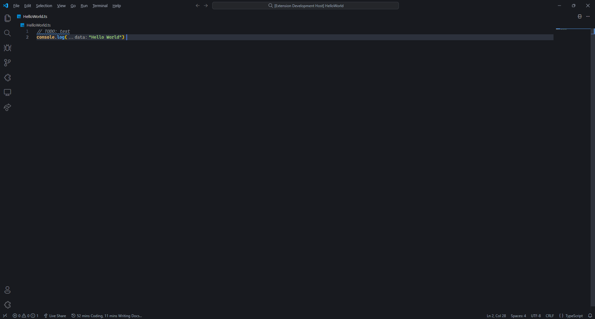
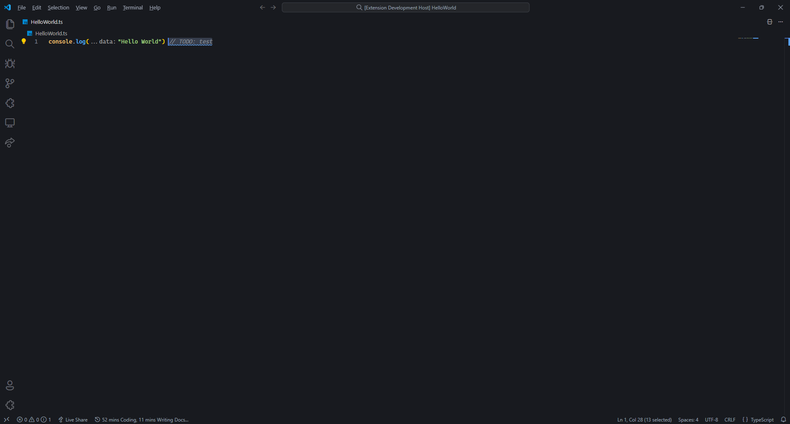
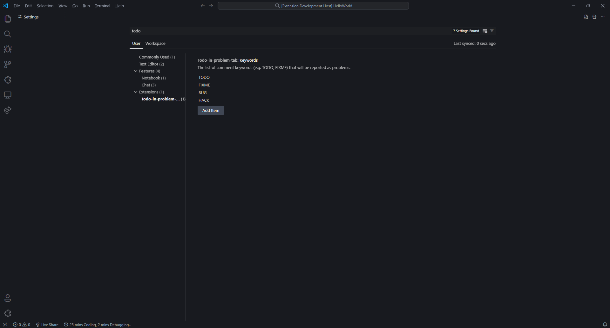

# todo-in-problem-tab 

One feature I liked with the Java Extension pack was that TODO were put in the problem tab so they were easy to see. I asked if it was possible to implement a similar feature gobally to VSCode but was kindly told extensions were already doing it and pointed to said extensions. None of the extensions I was told were doing what I asked so I did it myself.

## Features

This extension scans the opened document for comments with the various keywords (TODO, FIXME, BUG & HACK by default.). Each of those comments are then turned into a diagnostic and put in the problem tab.  
Either on a separate line.

Or the same line as code.

Default keywords are provided but you can extend this list to your liking.

## Planned Feature

This is only the first version and as such just has basic feature.   
Planned features are, in no specific order :

- Add support for languages not using // for comments.

## Known Issues

The logic to determine if a comment is in a string litteral and should be ignored is fairly basic and thus prone to breaking. I'll get around to doing a more robust version in the future.

## Release Notes

Below, you can find changelogs of the releases.

### 0.1

Initial release of the extension.

### 0.2

Add support for user-defined keywords.

### 0.3

Add support for comments on the same line as code.
